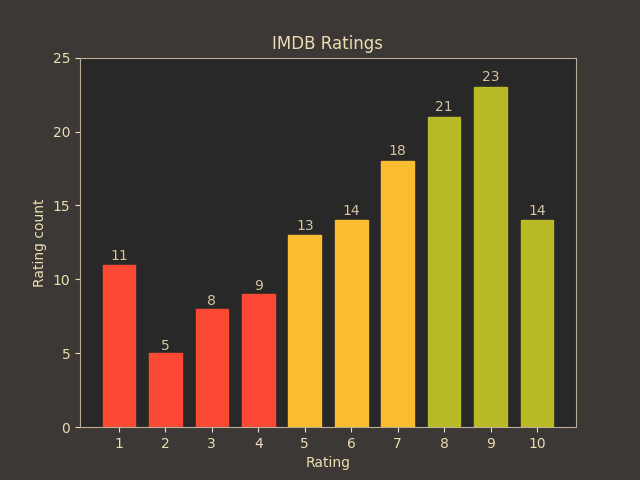

# imdb

This repository is a collection of scripts that we find useful for browsing data collected on IMDB.
To get your ratings data go to 'Your Ratings' and export.

## Capabilities

| Query | Functionality |
| --- | --- |
| `plot` | Plots in a window ratings occurance |
| `ratings` | Shows statistics about ratings |
| `genres` | Shows all genres |
| `with-rating <rating>` | Filter's all entries with given rating |
| `with-title <phrase>` | Filter's all entries with given title |

### Example plot
```
$ imdb.py save-plot example.png
```


Used color scheme is [Gruvbox](https://github.com/morhetz/gruvbox).
